# Three-loop top-quark triple box

This is the planar `g g -> H H` ladder with **one outer top-quark loop and two
internal gluon rungs**. Its eight massive top edges form the outside boundary
of three adjacent boxes. The two incoming gluons attach to the left end box;
the two outgoing Higgs legs attach to the right end box. The middle box has
no external leg.



The selected native HEPKit diagram is **D068**. It is the unique matching
ladder among 162 retained diagrams in a targeted three-loop generation using
only `ttg` and `ttH` vertices, QCD order 6, QED order 2 and exactly one fermion
loop, with initial/final symmetrization. This is one diagram, not the complete
Standard-Model amplitude. The top edges are `4,5,6,7,8,9,10,13`; the gluon rungs
are `11,12`. Native routing uses loop edges `4,8,10` and independent external
coordinates `P(0),P(1),P(2)`, with `P(3)=P(0)+P(1)-P(2)`.

`run.toml` requests `contraction_mode = "minimal"`. Lorentz and Dirac tensors,
top masses and model couplings remain symbolic. Only color is reduced before
export: HEPKit/Idenso closes one **unnormalized external `delta_ab`** with native
SU(3) conventions, `T_F=1/2`. A second native reduction using symbolic Casimirs
and the owner's invariant conversion agrees exactly. The remaining projector
contains the two incoming `(+,+)` Lorentz polarization vectors. There is no
color average, spin average, helicity sum or extra symmetry-factor multiplier.

The example uses internal dimension `D=4-2*eps`, four-dimensional external
wavefunctions and the normalized Minkowski loop measure
`prod_l d^D k_l/(i*pi^(D/2))`, with no extra scale or Euler-gamma factor. The
included point has `sqrt(s)=300`, `mH=125`, `MT=ymt=172.5`, zero widths and
`cos(theta)=4/5`. The native momentum and wavefunction APIs verify routing,
momentum conservation, on-shell conditions and polarization Gram products.

Generation retains the default SymJIT evaluator backend at optimization level O2.
Run these commands from the repository root when ready:

```sh
./target/release/fastsecdec generate examples/gghh_triple_box_bis/run.toml \
  --output output/gghh_triple_box_bis.fsd --workers 8

./target/release/fastsecdec inspect output/gghh_triple_box_bis.fsd
./target/release/fastsecdec inspect output/gghh_triple_box_bis.fsd --sector 0
```

For Havana sampling of the full Laurent vector:

```sh
./target/release/fastsecdec integrate output/gghh_triple_box_bis.fsd \
  --full-integral --parameters examples/gghh_triple_box_bis/point.toml \
  --method discrete_mc --workers 8 --points 32768 --shifts 32 --seed 20261008 \
  --target-order 0 --relative-tolerance 0.01 --absolute-tolerance 0 --max-rounds 8 \
  --checkpoint output/gghh_triple_box_bis.mc.checkpoint.json \
  --save-result output/gghh_triple_box_bis.mc.result.json
```

For randomized lattice QMC:

```sh
./target/release/fastsecdec integrate output/gghh_triple_box_bis.fsd \
  --full-integral --parameters examples/gghh_triple_box_bis/point.toml \
  --method qmc --workers 8 --points 4096 --shifts 32 --seed 20261008 \
  --target-order 0 --relative-tolerance 0.001 --absolute-tolerance 0 --max-rounds 8 \
  --checkpoint output/gghh_triple_box_bis.qmc.checkpoint.json \
  --save-result output/gghh_triple_box_bis.qmc.result.json
```

These request 1% (Havana) and 0.1% (QMC) relative uncertainty on the finite
coefficient, with at most eight refinement rounds. Reaching a work limit does
not guarantee the requested accuracy. Havana `points` and
`shifts` denote global points per batch and independent batches; QMC uses
points per shifted lattice and random shifts. All Laurent components and
their covariance are retained. See the [runtime guide](../../docs/RUNTIME_INTEGRATION.md)
for accuracy targets, refinement, stability and checkpoint options.

The incoming gluon self-products `P(0)^2 = P(1)^2 = 0` are fixed exactly in
`run.toml` with `value = "0"`, before parametrization and sector finding. This
allows generation to include the corresponding infrared boundaries. Regenerate
any artifact built with generic runtime `p0p0` and `p1p1`: setting them to zero
only during integration cannot restore missing sectors or poles. The updated
point card omits those fixed inputs.

The remaining thirteen scalar products and six contributing model leaves
(`model::Gf`, `model::MT`, `model::MZ`, `model::aEWM1`, `model::aS`,
`model::ymt`) are runtime inputs. Their numerical values come from `point.toml`
at integration time. The native model resolves analytic dependent couplings;
the numeric parameter card supplies metadata defaults and zero-width
restrictions, not substitutions into the tensor numerator. Runtime top mass
must remain finite, real and nonzero; a massless specialization needs separate
generation. Threshold safety is the caller's responsibility. No threshold
regularization or certification is performed.

The artifact base `output/gghh_triple_box_bis.fsd` will identify adjacent human
metadata `.fsd.json` and binary evaluator/expression `.fsd.dat` files. Move the
pair together. Paths in this example are relative.

`source-diagram.dot` and `source-model.json` retain the original native selected
source. `raw-diagram.json`, `raw-diagram.dot` and the separate `raw-*.txt` files
retain its tensor numerator, original prefactor, projector and bookkeeping
factor after applying the physical model card. A complete native payload
comparison verifies that this card transport changes only the model fingerprint
and derived diagram ID, preserving every label, fragment, port and momentum
signature. Reapplying `parameters.json` leaves `model.json`'s fingerprint unchanged.

In `graph.dot`, the color-projected tensor appears **once**, in the graph-level
`numerator_prefactor`, multiplied by the original raw numerator prefactor.
The graph's `numerator` and every vertex/edge numerator are `1`. This encoding
satisfies HEPKit's native aggregate/local-fragment invariant without repeating
the entire tensor at `v0`. The two-polarization projector and native evaluated
overall factor remain separate and enter once. The complete weighted product
is checked exactly before and after export, and the finalized DOT round-trip
preserves the complete native payload. `color-projected-numerator.txt` records
the tensor separately for inspection; it is not an additional input factor.

`generation.json` and `provenance.json` describe this three-loop selection and
its construction. Native graph/color/routing/model/Gram checks have passed.
FastSecDec parameterization, sector generation, evaluator compilation and
integration have deliberately **not** been run for this new example; no sector
counts, timing forecast or numerical result is claimed. The original
`examples/gghh_triple_box/` remains a separate input.
